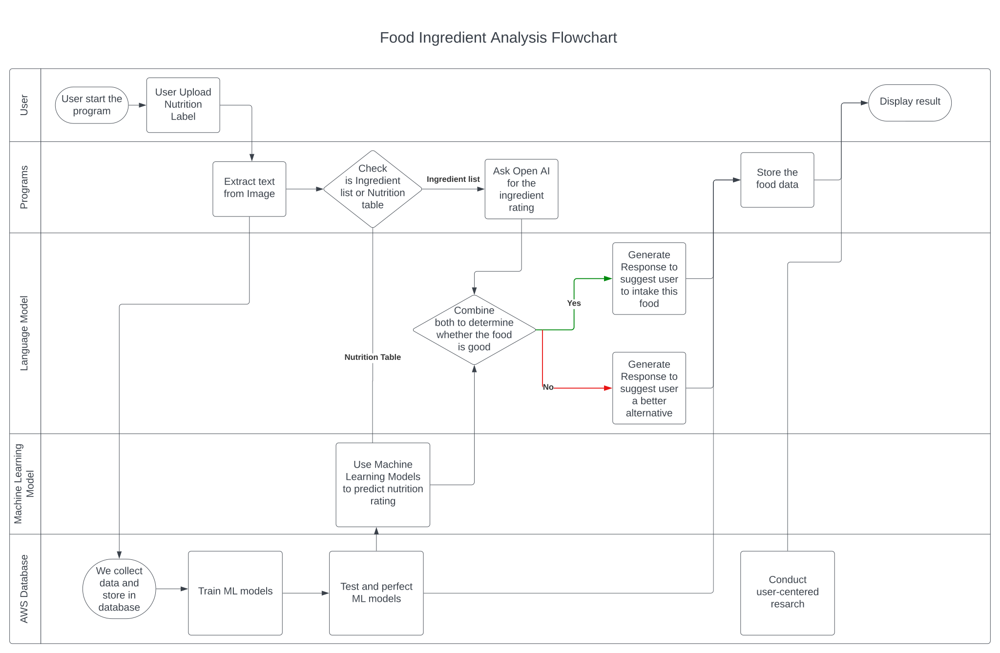

#  Lechonk - An AI driven Food Nutrition Analysis

## Project Overview

### Background

Smart food labeling provides a comprehensive breakdown of the nutritional information associated with food products. The AI system analyzes the extracted text to determine the quantities of macronutrients (such as carbohydrates, proteins, and fats) and the total caloric content. This information is displayed in a user-friendly format, enabling consumers to make informed decisions regarding their dietary choices.

### About

A key aspect of smart food labeling is the detailed analysis of the ingredients used in food products. The AI system evaluates the ingredients list and cross-references it with an extensive database of recognized ingredients. This helps identify specific components within the product, making it easier for consumers to quickly determine if a product meets their dietary needs or restrictions.

For more details on the functionality, refer to the code, where each function is clearly described in its respective docstrings.

## Project Workflow

## Features

- **OCR Text-Scanning**: Extract nutritional and ingredient information from food packaging images
- **Web Crawling**: Gathers additional nutritional data from sources like EWG and Costco
- **Data Cleaning**: Prepare Data for Machine Learning Models
- **Machine Learning Models**: Uses Linear Regression and Decision Tree models for prdictive analysis
- **Recommendation Algorithm**: Suggests products based on nutrition rating

## Next Step:

- **Live Image Capture**
- **Increase Model Performance**
